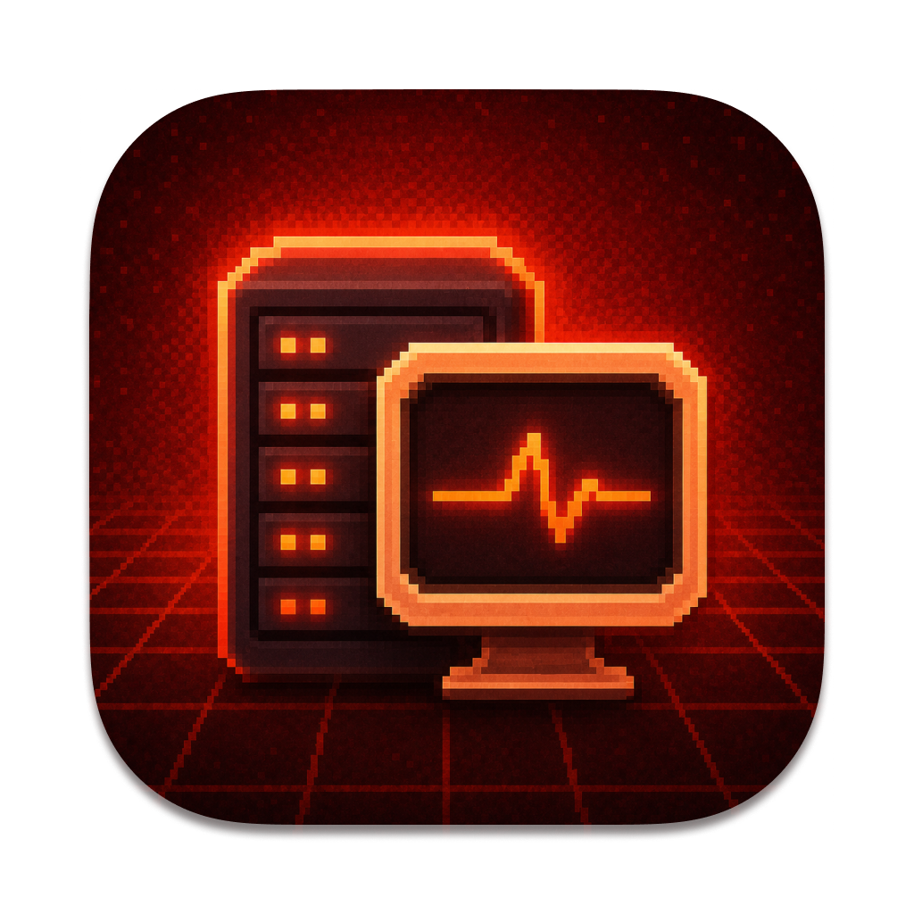
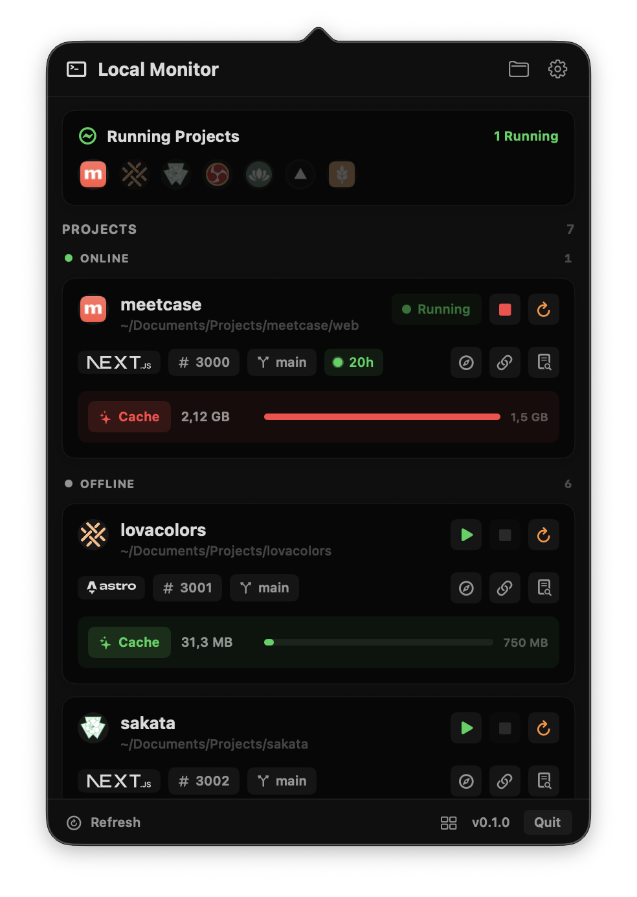
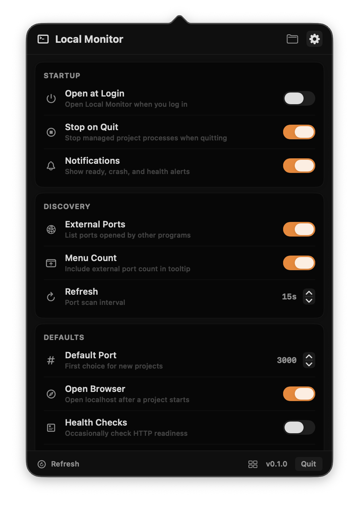

# Local Monitor

<p align="center">
  
</p>

**Native macOS menu bar control for local web projects and ports.** Start, stop, inspect, group, and clean local Next.js, Astro, Hono, and other dev servers right from your menu bar.

<p align="center">
  <a href="https://github.com/burakereno/localmonitor/releases/latest/download/LocalMonitor.dmg">
    
  </a>
  &nbsp;
  <a href="https://github.com/burakereno/localmonitor/releases/latest">
    
  </a>
</p>

<p align="center">
  <sub>macOS 14.0+ · local development servers only · See <a href="#installation">Installation</a> for first-launch instructions</sub>
</p>

<p align="center">
  
  
</p>

## Features

- **Project control** — start, stop, restart, and open local web projects from the menu bar
- **Port awareness** — detects listening localhost ports and maps them back to project folders when possible
- **Framework detection** — detects Next.js, Astro, Hono, Vite, and other common local web app setups
- **Stable project ports** — stores each project's preferred port and warns when a process starts elsewhere
- **Online / offline grouping** — keeps running projects separated from stopped projects
- **Cache cleanup** — shows framework cache size and cleans Next.js / Astro cache folders on demand
- **Workspace groups** — start or stop saved groups of projects together
- **Logs and quick actions** — copy localhost URLs, open in browser, inspect logs, and reveal folders
- **One-click in-app updates** — checks GitHub releases, downloads the latest DMG, and installs it
- **Native macOS** — SwiftUI + AppKit, runs as a menu bar app

## Installation

### Download DMG

1. Go to the [Releases](../../releases/latest) page
2. Download **`LocalMonitor.dmg`**
3. Open the DMG and drag **Local Monitor.app** to your **Applications** folder

### Important: First Launch (Unsigned App)

Since Local Monitor is not notarized by Apple, macOS may block it on first launch. To fix this, run the following command in Terminal **once** after installing:

```bash
xattr -cr "/Applications/Local Monitor.app"
```

Then double-click Local Monitor to launch it. The app appears in your menu bar and is shown as **Local Monitor**.

## Build from Source

### Requirements

- macOS 14.0+
- Xcode 16.0+
- Swift Package Manager

### Steps

```bash
git clone https://github.com/burakereno/localmonitor.git
cd localmonitor

swift test
./scripts/build-app.sh
open ".build/Local Monitor.app"
```

## Tech Stack

- **SwiftUI** — popover UI
- **AppKit** — NSStatusItem, NSPopover, app lifecycle
- **Swift Package Manager** — build system
- **lsof / ps** — local port and process discovery
- **GitHub Releases** — in-app update checks and DMG distribution
