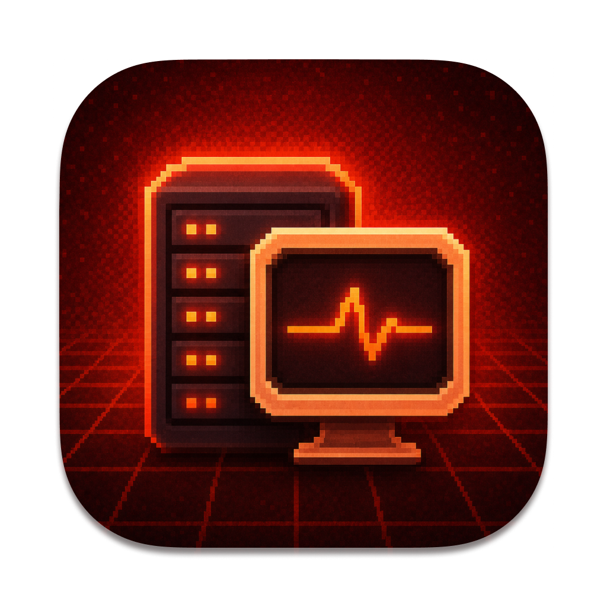
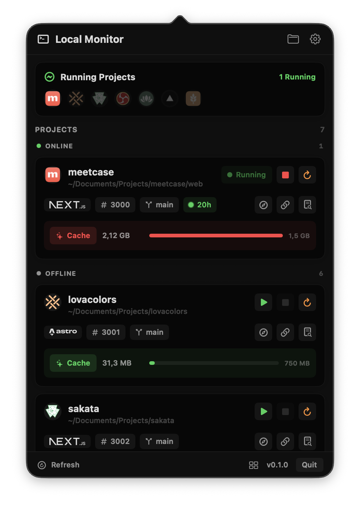
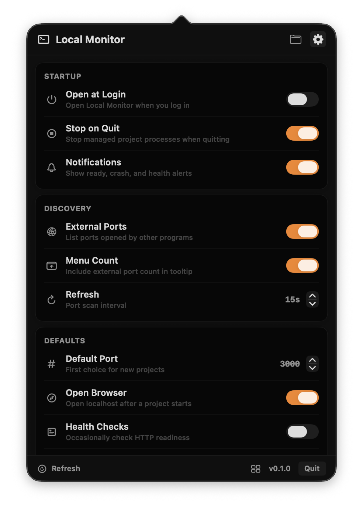

# Local Monitor

<p align="center">
  
</p>

**Native macOS menu bar control for local web projects and ports.** Start, stop, inspect, group, and clean local Next.js, Astro, Hono, and other dev servers right from your menu bar.

<p align="center">
  <a href="https://github.com/burakereno/localmonitor/releases/latest/download/LocalMonitor.dmg">
    
  </a>
  &nbsp;
  <a href="https://github.com/burakereno/localmonitor/releases/latest">
    
  </a>
</p>

<p align="center">
  <sub>macOS 14.0+ · local development servers only · Developer ID signed and notarized</sub>
</p>

<p align="center">
  
  
</p>

## Features

- **Project control** — start, stop, restart, and open local web projects from the menu bar
- **Port awareness** — detects listening localhost ports and maps them back to project folders when possible
- **Framework detection** — detects Next.js, Astro, Hono, Vite, and other common local web app setups
- **Workspace apps** — detects runnable apps in npm workspace folders, lets you add other apps from a saved project's Workspace Apps button, and saves a separate working folder and launch command for each app
- **Local hostnames** — supports customer addresses such as `mirayoga.localhost`; browser links, copied URLs, and HTTP health checks use the saved hostname
- **Stable project ports** — stores each project's preferred port and warns when a process starts elsewhere
- **Online / offline grouping** — keeps running projects separated from stopped projects
- **Optional HTTP health checks** — allows 30 seconds for initial preparation and requires three consecutive failed checks before showing No Response; disabling checks uses listening ports only
- **Cache cleanup** — shows framework cache size and cleans Next.js / Astro cache folders on demand
- **Workspace groups** — start or stop saved groups of projects together
- **Logs and quick actions** — copy localhost URLs, open in browser, inspect logs, and reveal folders
- **One-click in-app updates** — checks GitHub releases, downloads the latest DMG, and installs it
- **Native macOS** — SwiftUI + AppKit, runs as a menu bar app

## Installation

### Download DMG

1. Go to the [Releases](../../releases/latest) page
2. Download **`LocalMonitor.dmg`**
3. Open the DMG and drag **Local Monitor.app** to your **Applications** folder

Release downloads are Developer ID signed and notarized. Double-click Local Monitor to launch it. The app appears in your menu bar and is shown as **Local Monitor**.

## Build from Source

### Requirements

- macOS 14.0+
- Xcode 16.0+
- Swift Package Manager

### Steps

```bash
git clone https://github.com/burakereno/localmonitor.git
cd localmonitor

swift test
./scripts/build-app.sh
open ".build/Local Monitor.app"
```

## Tech Stack

- **SwiftUI** — popover UI
- **AppKit** — NSStatusItem, NSPopover, app lifecycle
- **Swift Package Manager** — build system
- **lsof / ps** — local port and process discovery
- **GitHub Releases** — in-app update checks and DMG distribution

Release signing setup is documented in [docs/release-signing.md](docs/release-signing.md).

## Workspace Projects

Add the monorepo root containing `package.json` and its `workspaces` list. Local Monitor finds packages with a `dev` or `start` script and lets you select the apps to save. Each app runs its script directly in its own folder, so root npm wrappers cannot swallow port arguments. Ports declared in scripts and package managers declared at the workspace root are detected; hoisted `node_modules` are supported.

For a project such as meetcase-sites, Mirayoga and theme-preview get separate Start/Stop controls on ports 3100 and 3101. A single literal local hostname in Next.js `allowedDevOrigins` is suggested automatically; multiple origins keep `localhost` as the default. In Settings → Projects → Launch Settings, edit the command, hostname, or health check path. `{port}` in the command follows the saved port. Settings are saved and reused on every Start.

Use the grid-shaped **Workspace Apps** button on a project card or in Settings → Projects to add sibling apps. Already added apps show their saved hostname and port and cannot be added again; adding apps preserves their current settings and does not start, stop, or restart servers. Local Monitor checks current listeners during import and retains an app's declared port when that app is already running there.

For apps with several literal local addresses in `allowedDevOrigins`, the browser button offers the saved address plus each detected local hostname, all on the same running port. For example, theme-preview's catalogue and `luma.localhost` / `ritim.localhost` previews share one server and one Start/Stop profile. Wildcards and external origins are excluded. These addresses are browser shortcuts; the saved hostname still controls health checks and the default URL.

Saved workspace-root entries that still use a default launch command migrate to the app selected by the root workspace script when the new version opens. Existing custom commands, IDs, pins, and ports are retained. Projects that need a separate API server still require that server to be running; dependency startup is a future addition.
